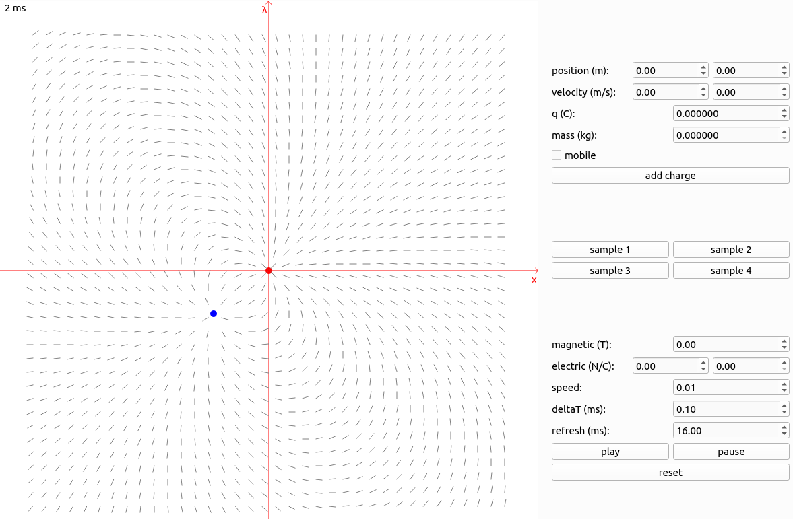
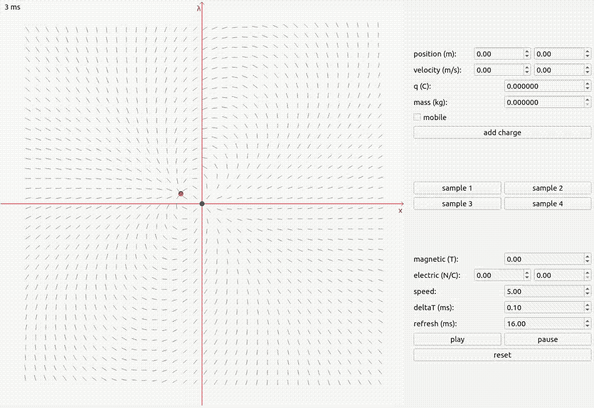
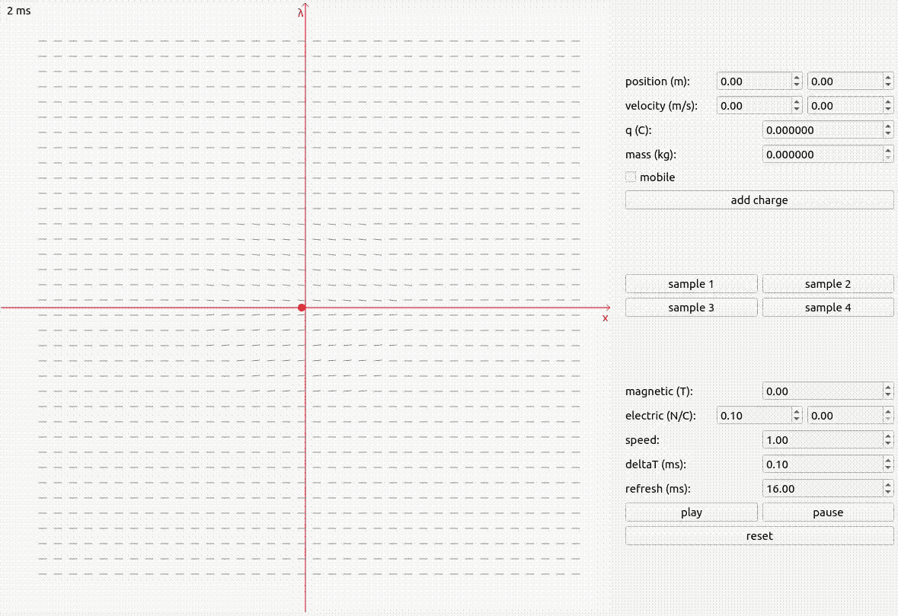

# Coulosim

Coluosim is stand for **Coulo**mb's law **sim**ulator.



## Installation

This project has been tested on `Ubuntu 22.04` with `Desktop Qt 6.7.2`.

1. Install Qt Prerequisites
   
   Ensure your system is up to date:
   
   ```shell
   sudo apt update && sudo apt upgrade
   ```
   
   Then, install the necessary dependencies. For Debian/Ubuntu-based distro:
   
   ```shell
   sudo apt install build-essential libgl1-mesa-dev
   ```
   
   Refer to the [Qt documentation](https://doc.qt.io/qt-6/linux.html#requirements-for-development-host) for installation instructions on other Linux distributions.

2. Download and Install Qt
   
   Download the Qt Online Installer (open source) from [Qt's official site](https://www.qt.io/download-open-source).
   
   Run the installer and select "Qt 6.7.2 for desktop development" to install the necessary Qt libraries for GCC.

3. Clone the Repository

   ```shell
   git clone https://github.com/mmmoradi/coulosim.git
   ```

4. Open project with Qt Creator and run it

## Usage

### Adding a Charge

When adding a charge to a simulation, you must specify the following properties:

- position [m]: The position of the charge in meters.
- velocity [m/s]: The velocity of the charge in meters per second.
- q [C]: The charge value in Coulombs.
- mass [kg]: The mass of the charge in kilograms.
- mobile: Determine whether the charge is mobile (can move) or static.

### Simulation Controls

- play/pause/reset: Control the simulation's state.
- magnetic field [T]: Set the external magnetic field strength in Tesla.
- electric field [N/C]: Set the external electric field strength in Newtons per Coulomb.
- speed: Adjust the speed of the simulation.
- deltaT [ms]: Set the time step in milliseconds.
- refresh [ms]: Set the refresh rate for the simulation in milliseconds.

### Predefined Samples

Load one of the predefined samples (Sample 1 to 4) to quickly start a simulation with preset configurations.

- Sample 1: Elliptical motion with a static positive charge and a negative charge with an initial velocity.
  
  

- Sample 2: Simulation of negative charge in an external electric field.
  
  

- Sample 3: Simulation of positive charge in an external magnetic field.
  
  

- Sample 4: Circular motion with a static negative charge and a positive charge with an initial velocity.
  
  

## TODO

- [ ] Add friction force to the simulation.
- [ ] Implement dynamic memory management for charge objects.
- [ ] Complete documentation.

## Contributing

Contributions are welcome! If you would like to contribute to this project, please fork the repository and create a pull request with your changes.

## License

This project is licensed under the MIT License. For more details, please see the `LICENSE` file in the repository.
